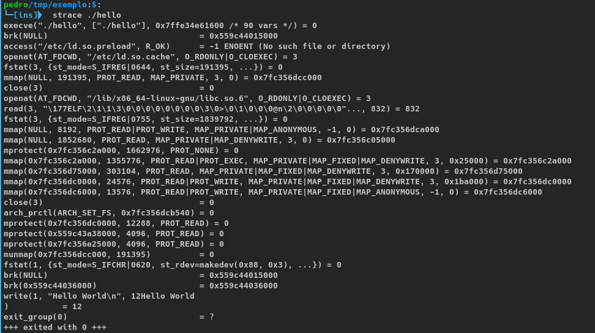

# Como funciona o Wine ?

Quase todos já usaram Wine ou usam todos os dias para jogar
alguns jogos ou até alguns software que não a versão nativa para
o Gnu/Linux porem muitos se confudem pensando que o wine é um
emulador! Mais se não é um emulador é oque ?

##### Bem o [Site Official](https://www.winehq.org/) definido como:

```
Wine (originally an acronym for "Wine Is Not an Emulator") is a
compatibility layer capable of running Windows applications on
several POSIX-compliant operating systems, such as Linux, macOS,
& BSD. Instead of simulating internal Windows logic like
a virtual machine or emulator, Wine translates Windows
API calls into POSIX calls on-the-fly, eliminating the
performance and memory penalties of other methods and
allowing you to cleanly integrate Windows applications
into your desktop.
```

##### Em português:

```
Wine (originalmente um acrônimo para "Wine Is Not an Emulator")
é uma camada de compatibilidade capaz de executar aplicativos
Windows em vários sistemas operacionais compatíveis com POSIX,
como Linux, macOS e BSD. Em vez de simular a lógica
interna do Windows como uma máquina virtual ou emulador,
o Wine converte chamadas de API do Windows em chamadas
POSIX dinamicamente, eliminando o desempenho e as
penalidades de memória de outros métodos e permitindo
que você integre aplicativos Windows em seu Desktop POSIX.
```


Então é perceptível que o objetivo do Wine de fazer o papel do
windows API em sistemas POSIX podendo assim executar binários PE
os "transformando" em ELF em tempo de execução. Também é
fornecido a WineLIB para desenvolvedores portarem seus software da
plataforma da microsoft para POSIX com maior facilidade.

#### **Tá** Oque é Syscall e API Calls ?

Bem é difícil explicar em poucas linhas mais vamos por partes,
usarei de exemplo o Hello World em C um programa muito básico
compilado e executado no **Gnu/Linux/Debian SID**
mais pode ser em qualquer outra linguagem.

O código é simples:

```c
#include <stdio.h> // Biblioteca de entrada e saida

int main(void) {
  printf("Hello World!\n");
  return 0;
}
```

**Para Compilar:**

```cc seuarquivo.c -o hello```

  Bem agora temos um programa que imprime na tela ```Hello World!```
mas em que momento escrevemos a função ```printf``` ? bem não
escrevemos então alguém escreveu, e quem foi ? No caso Debian é
utilizado a *Glibc* construida pelo projeto [GNU](gnu.org) mas
não é código da glibC que verdadeiramente imprime na tela a
glibc apenas faz a tradução para finalmente fazer a chamada o
kernel para imprimir na tela chamando a syscall write. Sendo o
kernel que faz toda a mágica acontecer e podemos ter mais
informação utilizando ```man 2 write``` sendo a sessão **2** do
man do Debian destinado as syscall do kernel.

Então um programa em C funciona mais o menos assim:

```programa->libs->syscall/kernel->hardware```

Em outras linguagem também funciona parecido a diferença é que
linguagem interpretada aumenta camadas de abstração um exemplo é
python que ficaria:

```programa.py->pythonvm->libs->syscall/kernel->hardware```

Já no assembly é possível ter uma camada a menos e fazer a
chamada ao kernel diretamente:

```programa->syscall/kernel->Hardware```

**Obs:** Compilando estaticamentemente não será feita chamadas
a bibliotecas, porém o código das lib estara contido no binario.

#### Olhando chamadas ao kernel

Olhar quais chamadas um programa faz ao kernel é muito
interessante e util para saber oque realmente um programa faz.
Um software muito utilizado para este fim é o ```strace```
disponivel nos repositorios do Debian poder ser instalado com o
apt:

``` apt install strace```

para utilizar é muito simples ```strace
caminhodoprograma/programa```

No caso vou utilizar com o hello world:



Podemos perceber que foram feitas varias chamadas ao kernel e a
penultima foi a write para escrever na tela. Você pode saber
para oque serve qualquer syscall utilizando ```man 2
nomedasyscall``` exemplo: ```man 2 brk```.


#### E no caso do Windows ?

Está vou ficar devendo por não ter conhecimento sobre o sistema
da Microsoft por ser uma sistema fechado. Isso complica aos
desenvolvedores do wine que muitas vezes recorregem a engenharia
reversa para poder fazer as converções e a algumas vezes que não
é encontrado uma Syscall adequada levando alguns jogos ficarem
um pouco "bugados".

#### Conclusão

Conclui que o Wine é um programa que funciona semelhante a
windows API traduzindo chamadas API para syscall POSIX podendo
assim executaveis
[PE](https://pt.wikipedia.org/wiki/Portable_Executable)
funcionarem em OS POSIX sem grande perca de desempenho por não
precisar emular todas as caracteristicas do sistema da
microsoft.

